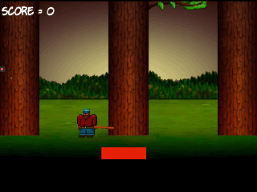

# Timber game written with c++ and SFML(Simple Fast Media Library).
This is a timber game. The code for this repo was inspired by a game instructor [John Horton].



## Prerequisites
* cmake >= 3.X
  * All OSes: [click here for installation instructions](https://cmake.org/install/)
* make >= 4.1 (Linux, Mac), 3.81 (Windows)
  * Linux: make is installed by default on most Linux distros
  * Mac: [install Xcode command line tools to get make](https://developer.apple.com/xcode/features/)
  * Windows: [Click here for installation instructions](http://gnuwin32.sourceforge.net/packages/make.htm)
* SFML >= 2.0
  * All installation instructions can be found [here](https://www.sfml-dev.org/download/sfml/2.5.1/)
  * Windows
    * [SFML 2.5.1 - GCC 7.3.0 MinGW (DW2) 32-bit (for Windows)](https://www.sfml-dev.org/files/SFML-2.5.1-windows-gcc-7.3.0-mingw-32-bit.zip)
  * MacOS
    * [SFML 2.5.1 - Clang 64-bit](https://www.sfml-dev.org/files/SFML-2.5.1-macOS-clang.tar.gz)
    * Command Line Tools / XCode (type "xcode-select --install" in terminal to trigger the installer)
    * [Homebrew](https://brew.sh/) (for makeicns, or to optionally install SFML)
  * Linus
    * Get SFML 2.5.1 from your distro if it has it, or compile from source
* gcc/g++ >= 5.4
  * Linux: gcc / g++ is installed by default on most Linux distros
  * Mac: same deal as make - [install Xcode command line tools](https://developer.apple.com/xcode/features/)
  * Windows: recommend using [MinGW](http://www.mingw.org/)


## SFML Installation

### Windows

1. Download & Extract SFML to **C:/SFML-2.5.1/** where the bin/lib/include folders are contained within
2. Download & Extract MinGW to **C:/mingw32/** where the bin/lib/include folders are contained within

### MacOS

1. Install "Command Line Tools" in MacOS if they're not already installed (type "xcode-select --install" in terminal)
2. Follow the "Installing SFML" directions here: https://www.sfml-dev.org/tutorials/2.5/start-osx.php#installing-sfml

### Linux
1. Ensure the GCC Toolchain is installed (**sudo apt install build-essential**)
2. Run **sudo apt install libsfml-dev**. The SFML version you got will vary depending on the distro. 2.5.1 is included in [Ubuntu 19.04 Disco Dingo](http://cdimage.ubuntu.com/daily-live/current/HEADER.html) for example.


## Basic Build Instructions

1. Clone this repo.
2. Make a build directory in the top level directory: `mkdir build && cd build`
3. Compile: `cmake .. && make`
4. Run it: `./capstone-timber`.


## Class file description

```
+ Entity is an abstract class that all other derived class inherits from.
+ Axe class is responsible for the tree axe.
+ Bee class is responsible for creating all the bees.
+ Branch class is responsible for creating all the branches of a tree.
+ Cloud class is responsible for creating all the clouds that hover on the.
+ Game class is composed of all the objects that is required for the game to function.
+ Player class is a blueprint of the player object.
+ Rip class is a blueprint of the RIP stone.
+ Tree class is the trees blueprint.

```

## Rubric specification

```

| Criteria                                                                                                    | File          | Lines         |
| ----------------------------------------------------------------------------------------------------------- |:-------------:|:-------------:|
| The project demonstrates an understanding of C++ functions and control structures.                          | game.cpp      |  110,121,139  |
| Classes use appropriate access specifiers for class members.                                                | *.h           |               |
| Class constructors utilize member initialization lists.                                                     | game.cpp      | 3 - 43        |
| Derived class functions override virtual base class functions.                                              | log.cpp       | 10 - 18       |
| The project uses move semantics to move data, instead of copying it, where possible.                        | game.cpp      | 50,56,62,71   |
| The project uses smart pointers instead of raw pointers.                                                    | entity.h      | 10,11         |


```

